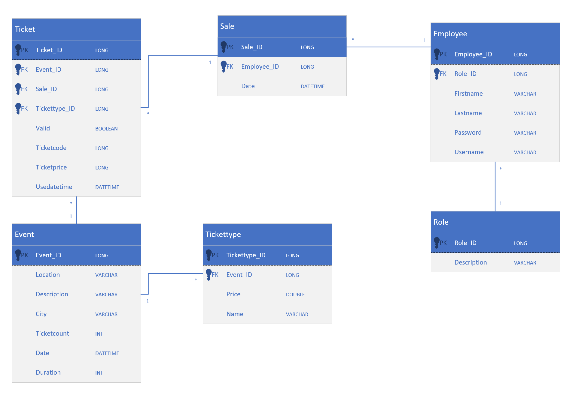

# TicketGuru

Tiimi: Max Arponen, Mirka Heikkilä, Elina Hilkko, Jussi Junnila, Emmi Sulander (Ryhmä Github Newbies)

## Johdanto

Ticketguru on lipunmyyntiin tarkoitettu sovellus. Käyttäjä lisää sovellukseen tapahtumat tietoineen ja lippuhintoineen. Hän voi myydä lippuja ja tarkastella myyntihistoriaa. Yksittäisessä myyntitapahtumassa voi olla myyty useampi lippu erilaisilla hinnoilla (opiskelijahinta, eläkeläishinta) useampaan tapahtumaan. Jokaisella lipulla on yksilöity koodi, joka on helppo tarkastaa tarvittaessa. 

Ensimmäiseen lopulliseen versioon ei tule verkkokaupan ominaisuuksia, eli lippuja haluavat asiakkaat eivät itse pysty ostamaan lippuja sovelluksella. Sovellus on siis lipputoimiston käyttöön ja myyntitapahtumia hallinnoi joku sovelluksen käyttäjistä (**myyjä**). Sovellusta ollaan aikeissa jatkokehittää ja tulevaisuudessa lisätä verkkokauppa.

Ticketgurulla käyttääjä voi muun muassa:
+ **Lisää Tapahtuma** (Nimi, ajankohta, paikka, kuvaus, kaupunki, myytävien lippujen määrä)
+ **Lisätä lipputyyppejä** (Aikuinen, lapsi, eläkäinen jne.)
+ **Myy lippuja** (Mihin tapahtumiin, montako lippua)
+ **Tulostaa myydyt liput**
+ **Tutkia myyntiraportteja** (Yhteenveto myynnistä tapahtumaan X. Halutessa selaa yksittäisiä myyntitapahtumia)

## Järjestelmän määrittely

### Käyttäjäroolit
+ **Myyjä** - Myy ja tulostaa lippuja asiakkaalle

+ **Ylläpitäjä** - Vastaa järjestelmän tapahtumien ja lippujen päivittämisestä ja ajaa haluttuja raportteja

### Käyttäjätarinat

1. Myyjänä haluan hakea tapahtumia eri hakusanoilla, jotta voin myydä asiakkaalle haluamansa lipun.

2. Myyjänä haluan valita eri lipputyyppejä, jotta saan myytyä asiakkaalle oikean lipun. 

3. Myyjänä haluan valita useamman lipun kerrallaan, jotta voin myydä asiakkaalle monta lippua kerralla. 

4. Myyjänä haluan saada liput tulostettua, jotta voin toimittaa ne asiakkaalle.

5. Myyjänä haluan nähdä monta lippua kyseiseen tapahtumaan on myyty ja myymättä, jotta voin helposti tulostaa jäljellä olevat liput ovella myytäviksi.

6. Ylläpitäjänä haluan listauksen tapahtuman myyntiraportista, jotta saan raportin myydyistä lipuista eri tarkoituksia varten.

7. Ylläpitäjänä haluan listauksen kaikista myyntitapahtumista, jotta niitä voi hallinnoida. 

8. Ylläpitäjänä haluan lisätä uusia tapahtumia, jotta niiden lippuja voisi myydä.

9. Ylläpitäjänä haluan muokata tapahtumien tietoja, jotta ne pysyisivät ajantasalla.

10. Ylläpitäjänä haluan muokata lippujen tietoja, jotta voin muokata hintoja tai lipputyyppejä.

## Käyttöliittymä

### UML-kaavio

[Rautalankamalli](https://github.com/koodiameles/ticketguru/blob/main/Kuvat/Wireframe.pdf) kuvaa tarkemmin eri näkymien yhteyksiä ja toimintoja.

## Tietokanta

### Tietokantakaavio
 

> ### _Employee – Työntekijä_
> Työntekijä-taulu sisältää tiedon tyontekijän etu- ja sukunimestä, roolista, käyttäjänimestä ja salasanasta. Työntekijällä voi olla myös useita myyntitapahtumia tehtynä.
> 
> Kenttä | Tyyppi | Kuvaus
> ------ | ------ | ------
> id | long PK | Työntekijän id
> rooli | long FK | Viittaus Roolit-tauluun. Määrittelee työntekijän oikeudet käyttää järjestelmää
> firstname | varchar(50) | Työntekijän etunimi
> lastname | varchar(50) | Työntekijän sukunimi
> username | varchar(15) | Käyttäjänimi
> password | varchar(70) | Salasana

> ### _Role – Rooli_
> Rooli-taulu sisältää työntekijöiden käyttöoikeudet järjestelmässä. Työntekijällä voi olla vain yksi rooli. Tietty rooli voi kuulua monelle eri työntekijälle.
>
> Kenttä | Tyyppi | Kuvaus
> ------ | ------ | ------
> id | long PK | Roolin tunnus
> description | varchar(100) |  Lyhyt kuvaus roolin oikeuksista järjestelmässä. Esim. Admin/User

> ### _Event – Tapahtuma_
> Tapahtuma-taulu sisältää tapahtuman tiedot. Tapahtumaan voidaan olla lisätty useita lipputyyppejä, mutta lipputyyppi kuuluu aina vain yhdelle tapahtumalle. Tapahtumaan voidaan myydä useita lippuja, mutta yksi lippu kuuluu aina vain yhteen tapahtumaan. Tapahtumaan liittyy yksi raportti ja raportti voi kuulua aina vain yhdelle tapahtumalle.
>
> Kenttä | Tyyppi | Kuvaus
> ------ | ------ | ------
> id | long PK | Tapahtuman id
> description | varchar(100) | Tapahtuman nimi/kuvaus
> location | varchar(50) | Tapahtumapaikka esim. Finlandiatalo
> city | varchar(50) | Kaupunki, jossa tapahtumapaikka sijaitsee
> ticketcount | int | Myytävien lippujen maksimimäärä
> datetime | datetime | Tapahtuman ajankohta. PVM sekä KLO.
> duration | int | tapahtuman arvioitu kesto minuutteina esim. 90 min

> ### _Ticket – Lippu_
> Lippu-taulu sisältää lipun tiedot. Lippu voi kuulua vain yhteen tapahtumaan (event). Lippu voi kuulua vain yhteen myyntitapahtumaan (sale).
>
> Kenttä | Tyyppi | Kuvaus
> ------ | ------ | ------
> id | long PK | Roolin tunnus
> event | long FK | Viittaus tapahtuma -tauluun. Mihin tapahtumaan lippu on myyty.
> sale | long FK | Viittaus sale -tauluun. Mihin myyntitapahtumaan lippu liittyy.
> tickettype | long FK | Viittaus tickettype -tauluun. Minkä tyyppinen lippu tämä on. (Child/Adult/...)
> ticketprice | double | Lipun hinta. Voidaan ottaa tickettypen mukaan tai syöttää manuaalisesti.
> valid | boolean |  Onko lippu voimassa. Esim. onko käytetty
> ticketcode | varchar(20) |  Onko lippu voimassa. Esim. onko käytetty
> useddatetime | datetime |  Ajankohta milloin lippu on käytetty. PVM sekä KLO.

> ### _Sale – Myyntitapahtuma_
> Myyntitapahtuma-taulu sisältää tiedot myyntitapahtumasta ja siihen liittyvistä lipuista. Myyntitapahtuma kertoo, kuka työntekijä liput on myynyt ja koska. Myyntitapahtumaan voi liittyä useampia lippuja, mutta ainoastaan yksi työntekijä.
> 
> Kenttä | Tyyppi | Kuvaus
> ------ | ------ | ------
> id | long PK | Myyntitapahtuman id
> employee | long FK | Myynnin suorittanut työntekijä, viittaus tyontekija -tauluun
> date | datetime | Myyntitapahtuman ajakohta

> ### _Tickettype – Lipputyyppi_
> Lipputyyppi-taulu sisältää, minkälaisia lipputyyppejä on mahdollista saada tapahtumaan, esimerkiksi lapsi, aikuinen, eläkeläinen, opiskelija. Tapahtumalla voi olla useita lipputyyppejä.
>
> Kenttä | Tyyppi | Kuvaus
> ------ | ------ | ------
> id | long PK | Lipputyypin id
> description | varchar(100) | Kuvaus lipputyypistä, esim. opiskelija
> price | double | Paljonko kyseinen lippu maksaa, esim. 8.00
> event | long FK | Tapahtuma johon tämä lipputyyppi on liitetty, viittaus tapahtuma-tauluun

## REST API

### Endpoints, ei autentikointia (No authentication)

Endpointit, joihin kaikilla käyttäjillä on pääsy: 

Login : POST /login/

### Endpoints, vaatii autentikoinnin (Authentication required)

Endpointit, joihin pääsy edellyttää user- tai admin-käyttöoikeudet:

+ [**Näytä kaikki tapahtumat**](APIdokumentaatio/getallevents.md) : `GET /events`
+ [**Näytä yksi tapahtuma (ID)**](APIdokumentaatio/getoneevent.md) : `GET /events/{id}`
+ [**Näytä kaikki lipputyypit**](APIdokumentaatio/getalltickettypes.md) : `GET /tickettypes`
+ [**Näytä yksi lipputyyppi (ID)**](APIdokumentaatio/getonetickettype.md) : `GET /tickettypes/{id}`
+ [**Näytä kaikki liput**](APIdokumentaatio/getalltickets.md) : `GET /tickets`
+ [**Näytä yksi lippu (ID)**](APIdokumentaatio/getoneticket.md) : `GET /tickets/{id}`
+ [**Näytä yksi lippu (ticketcode)**](APIdokumentaatio/getoneticketcode.md) : `GET /tickets?code={ticketcode}`
+ [**Näytä kaikki myyntitapahtumat**](APIdokumentaatio/getallsales.md) : `GET /sales`
+ [**Näytä yksi myyntitapahtuma (ID)**](APIdokumentaatio/getonesale.md) : `GET /sales/{id}`
+ [**Luo myyntitapahtuma**](APIdokumentaatio/postsale.md) : `POST /sales`
+ [**Muuta lippu käytetyksi**](APIdokumentaatio/patchticket.md) : `PATCH /tickets?code={ticketcode}`

Endpointit, joihin pääsy edellyttää admin-käyttöoikeudet: 

+ [**Luo tapahtuma**](APIdokumentaatio/postevent.md) : `POST /events`
+ [**Päivitä tapahtuma**](APIdokumentaatio/putevent.md) : `PUT /events/{id}`
+ [**Poista tapahtuma**](APIdokumentaatio/deleteevent.md) : `DELETE /events/{id}`
+ [**Luo lipputyyppi**](APIdokumentaatio/posttickettype.md) : `POST /tickettypes`
+ [**Luo lippu myyntitapahtumaan**](APIdokumentaatio/postticket.md) : `POST /sales/{id}/tickets`
+ [**Näytä kaikki työntekijät**](APIdokumentaatio/getallemployees.md) : `GET /employees`
+ [**Luo työntekijä**](APIdokumentaatio/postemployee.md) : `POST /employees`
+ [**Päivitä työntekijä**](APIdokumentaatio/putemployee.md) : `PUT /employees/{id}`
+ [**Poista työntekijä**](APIdokumentaatio/deleteemployee.md) : `DELETE /employees/{id}`

## Testaus

Sovelluksesta on testattu tärkeimpiä ominaisuuksia, joiden vähintään tulee toimia, jotta järjestelmä toimii halutulla tavalla.

Olennaista on esimerkiksi pystyä luomaan tapahtuma ja myymään siihen lippuja. Näihin liittyviä toimintoja on testattu onnistuneesti sekä automaatiotesteillä että manuaalisilla testeillä.  

[Testiraportti](APIdokumentaatio/testreport.md) kuvailee tarkemmin testitapausten toteutusta ja toimintaa.

## Asennustiedot

### Kehitysympäristön käyttöönotto

+ Projektin voi kloonata GitHubista (https://github.com/koodiameles/ticketguru). Projektin voi avata Visual Studio Codella tai Eclipsellä. 
+ Kehitysympäristössä tietokantana voi käyttää h2-kantaa. 
+ Pysyvämpää tietokantaa varten koneelle asennetaan PostgreSQL-tietokanta. 
+ Käyttäjätunnukset ja salasanat ovat hallinnoitavissa application-heroku.properties- ja application-local.properties-tiedostoissa. Application.properties-tiedostossa voi määrittää, käytetäänkö kehitysympäristössä h2- vai PostgreSQL-kantaa.   
+ Postmanilla pyynnöt tulee autentikoida. 

### Tuotantoympäristön käyttöönotto 

+ Projekti on julkaistu Herokussa. 
+ Sovelluksen Herokussa toimivan tietokannan osoite, käyttäjätunnus ja salasana löytyvät projektin Settings-välilehdeltä kohdasta "Config Vars". Näitä tarvitaan, jotta saadaan luotua tietokantayhteys. 
